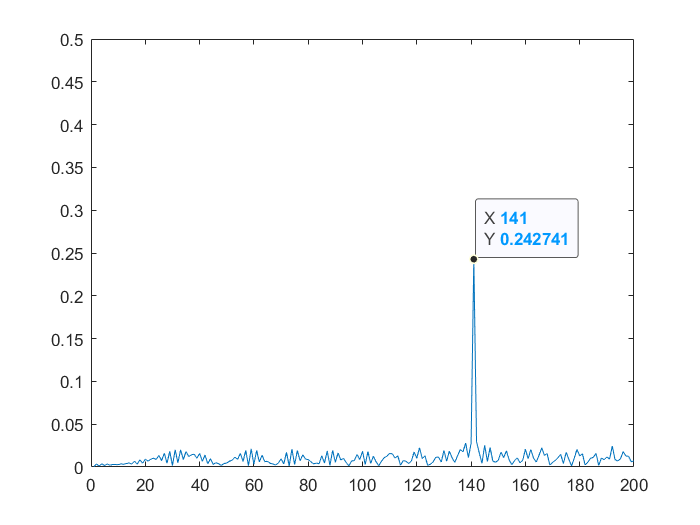

# Radar Target Generation and Detection
The project layout is described as the below figure

1. FMCW Radar specifications: 
    

    Bandwidth (B), Chirp Time (Tchirp) and Slope (slope) of the FMCW chirp have been calculated  using the above requirements as follows:
    

2. Target Signal Generation :

    Simulating the signal propagation and moving target with a constant velocity:
 
    FMCW transmitted and received signals are defined using these wave equations:  

         
         
         

3. Range FFT (1st FFT)
    * Implement the 1D FFT on the Mixed Signal
    * Reshape the vector into Nr*Nd array.
    * Run the FFT on the beat signal along the range bins dimension (Nr)
    * Normalize the FFT output.
    * Take the absolute value of that output.
    * Keep one half of the signal
    * Plot the output

4. 2D CFAR

    The steps to solve the task:
    * Determine the number of Training cells and the number of guard cells for each dimension.
    acordding to Tr, Td, Gr, Gd.

   * Slide the cell under test across the complete matrix.
   *  For every iteration sum the signal level within all the training cells. To sum convert the value from logarithmic to linear using db2pow function.
   * Average the summed values for all of the training cells used. After averaging convert it back to logarithmic using pow2db.
   * Further add the offset to it to determine the threshold.
   * Next, compare the signal under CUT against this threshold.
   * If the CUT level > threshold assign it a value of 1, else equate it to 0.
   * To suppress the non-thresholded cells at the edges. 
     * Initialize a RDM_M same size as the result from the 2D FFT with zeros
     * In the step where we compare the signal under CUT against this threshold, we put the result in the new RDM_M in the correct index taking into account (Tr, Td, Gr, Gd)

5. Results, Selection of Training, Guard cells and offset:

Taking into account the signal-to-noise ratio to choose an appropriate offset. also Observing the noise in both range and doppler dimension to detriment the suitable number for training and guard cells along each dimension. 
After many tests, we have selected the following parameters
 * Tr = 10
 * Td = 12
 * Gr = 4
 * Gd = 4
 * offset = 9 dB

 
## To test our model we used different initial range and velocity : 
 * R = 50 m , V= -50 m/s

 

  
   
  

 * R = 110 m , V= -20 m/s

 

  
   
  

 * R= 140 m, V= 30 m/s
 

  
   
  

 * R= 170 m, V= 70 m/s
 

  
   
  

  

